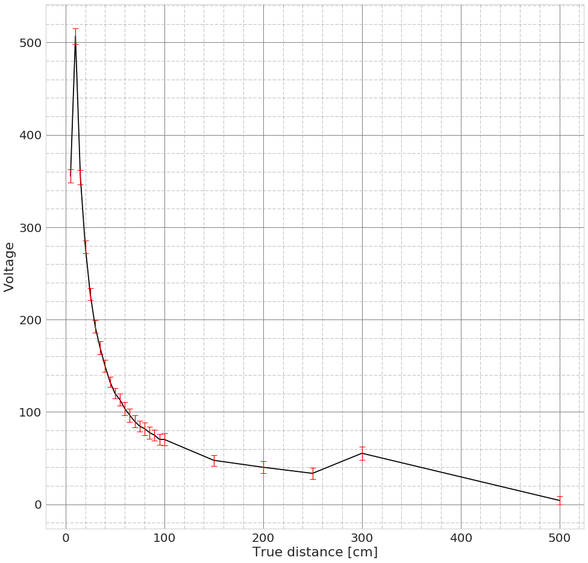
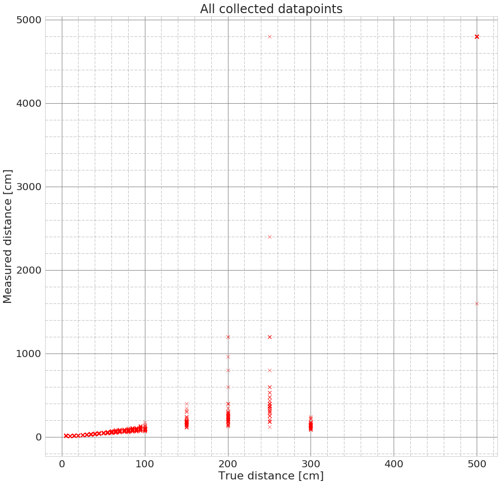
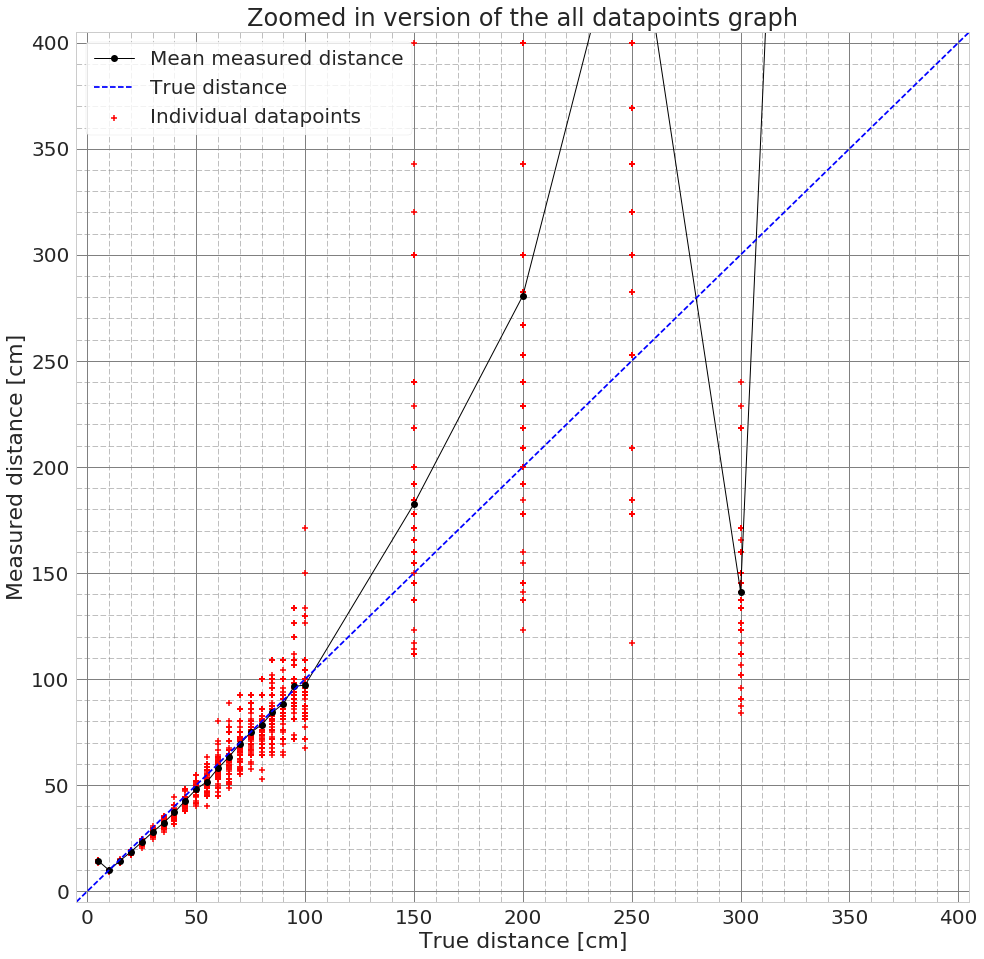
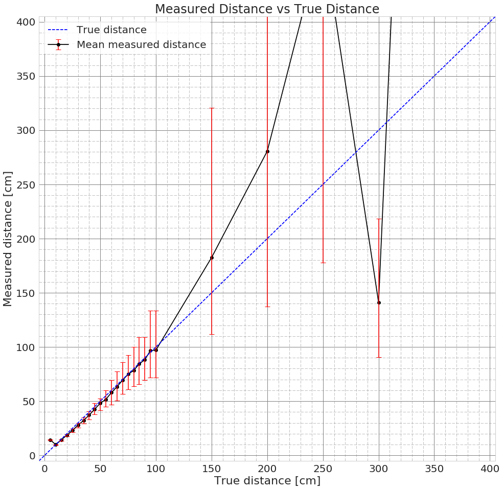

```python
%matplotlib inline

import numpy as np
import matplotlib.pyplot as plt
import pandas as pd
import seaborn as sns

# Set common default style for plots
sns.set(context='notebook', style='whitegrid', font_scale=2.0, rc={'figure.figsize': (16,16)})
```

# Fetch data
We have 100 voltage measurements for each of the 25 true distances.
_(The unit of voltage is some fraction of Volt, the actual value is not important.)_


```python
data = pd.read_csv('data/ir-final.csv')
data.describe()
```


<div>
<table border="1" class="dataframe">
  <thead>
    <tr style="text-align: right;">
      <th></th>
      <th>5cm</th>
      <th>10cm</th>
      <th>15cm</th>
      <th>20cm</th>
      <th>25cm</th>
      <th>30cm</th>
      <th>35cm</th>
      <th>40cm</th>
      <th>45cm</th>
      <th>50cm</th>
      <th>...</th>
      <th>80cm</th>
      <th>85cm</th>
      <th>90cm</th>
      <th>95cm</th>
      <th>100cm</th>
      <th>150cm</th>
      <th>200cm</th>
      <th>250cm</th>
      <th>300cm</th>
      <th>500cm</th>
    </tr>
  </thead>
  <tbody>
    <tr>
      <th>count</th>
      <td>100.000000</td>
      <td>100.00000</td>
      <td>100.000000</td>
      <td>100.000000</td>
      <td>100.000000</td>
      <td>100.000000</td>
      <td>100.000000</td>
      <td>100.000000</td>
      <td>100.000000</td>
      <td>100.000000</td>
      <td>...</td>
      <td>100.000000</td>
      <td>100.000000</td>
      <td>100.000000</td>
      <td>100.000000</td>
      <td>100.000000</td>
      <td>100.000000</td>
      <td>100.000000</td>
      <td>100.000000</td>
      <td>100.000000</td>
      <td>100.000000</td>
    </tr>
    <tr>
      <th>mean</th>
      <td>355.420000</td>
      <td>507.07000</td>
      <td>354.140000</td>
      <td>278.830000</td>
      <td>227.490000</td>
      <td>192.370000</td>
      <td>169.370000</td>
      <td>149.640000</td>
      <td>132.590000</td>
      <td>120.130000</td>
      <td>...</td>
      <td>81.950000</td>
      <td>77.660000</td>
      <td>74.860000</td>
      <td>70.410000</td>
      <td>70.270000</td>
      <td>47.660000</td>
      <td>40.140000</td>
      <td>33.560000</td>
      <td>55.300000</td>
      <td>4.240000</td>
    </tr>
    <tr>
      <th>std</th>
      <td>7.101259</td>
      <td>8.49748</td>
      <td>7.844473</td>
      <td>6.809166</td>
      <td>6.542009</td>
      <td>6.848512</td>
      <td>7.060568</td>
      <td>6.605049</td>
      <td>5.796368</td>
      <td>5.647302</td>
      <td>...</td>
      <td>6.846624</td>
      <td>6.481084</td>
      <td>5.687164</td>
      <td>5.937545</td>
      <td>6.303526</td>
      <td>5.889933</td>
      <td>6.516521</td>
      <td>6.069164</td>
      <td>6.904105</td>
      <td>4.612499</td>
    </tr>
    <tr>
      <th>min</th>
      <td>344.000000</td>
      <td>499.00000</td>
      <td>340.000000</td>
      <td>268.000000</td>
      <td>216.000000</td>
      <td>176.000000</td>
      <td>156.000000</td>
      <td>128.000000</td>
      <td>120.000000</td>
      <td>108.000000</td>
      <td>...</td>
      <td>68.000000</td>
      <td>64.000000</td>
      <td>64.000000</td>
      <td>56.000000</td>
      <td>48.000000</td>
      <td>32.000000</td>
      <td>24.000000</td>
      <td>16.000000</td>
      <td>40.000000</td>
      <td>0.000000</td>
    </tr>
    <tr>
      <th>25%</th>
      <td>351.000000</td>
      <td>500.00000</td>
      <td>350.000000</td>
      <td>274.000000</td>
      <td>224.000000</td>
      <td>189.000000</td>
      <td>166.000000</td>
      <td>146.000000</td>
      <td>130.000000</td>
      <td>118.000000</td>
      <td>...</td>
      <td>79.000000</td>
      <td>75.000000</td>
      <td>73.000000</td>
      <td>69.000000</td>
      <td>69.000000</td>
      <td>45.000000</td>
      <td>37.000000</td>
      <td>31.750000</td>
      <td>52.000000</td>
      <td>2.000000</td>
    </tr>
    <tr>
      <th>50%</th>
      <td>352.000000</td>
      <td>503.00000</td>
      <td>351.000000</td>
      <td>276.000000</td>
      <td>225.000000</td>
      <td>191.000000</td>
      <td>168.000000</td>
      <td>148.000000</td>
      <td>131.000000</td>
      <td>119.000000</td>
      <td>...</td>
      <td>81.000000</td>
      <td>78.000000</td>
      <td>74.000000</td>
      <td>70.000000</td>
      <td>70.000000</td>
      <td>48.000000</td>
      <td>39.000000</td>
      <td>33.000000</td>
      <td>54.000000</td>
      <td>3.000000</td>
    </tr>
    <tr>
      <th>75%</th>
      <td>360.000000</td>
      <td>513.25000</td>
      <td>356.250000</td>
      <td>282.250000</td>
      <td>229.000000</td>
      <td>195.000000</td>
      <td>173.000000</td>
      <td>151.000000</td>
      <td>135.000000</td>
      <td>122.000000</td>
      <td>...</td>
      <td>83.250000</td>
      <td>80.000000</td>
      <td>77.000000</td>
      <td>73.000000</td>
      <td>72.000000</td>
      <td>49.000000</td>
      <td>43.250000</td>
      <td>35.000000</td>
      <td>58.000000</td>
      <td>5.000000</td>
    </tr>
    <tr>
      <th>max</th>
      <td>383.000000</td>
      <td>540.00000</td>
      <td>383.000000</td>
      <td>299.000000</td>
      <td>255.000000</td>
      <td>214.000000</td>
      <td>191.000000</td>
      <td>172.000000</td>
      <td>147.000000</td>
      <td>139.000000</td>
      <td>...</td>
      <td>111.000000</td>
      <td>95.000000</td>
      <td>95.000000</td>
      <td>87.000000</td>
      <td>91.000000</td>
      <td>63.000000</td>
      <td>59.000000</td>
      <td>61.000000</td>
      <td>77.000000</td>
      <td>23.000000</td>
    </tr>
  </tbody>
</table>
<p>8 rows × 25 columns</p>
</div>


```python
trueDists = [5,10,15,20,25,30,35,40,45,50,55,60,65,70,75,80,85,90,95,100,150,200,250,300,500]
```

# Voltage vs. True Distance


```python
# We only need the mean voltages (to plot them) and standard deviations (for error bars)
voltages = data.describe().loc[['mean', 'std']]
voltages.loc['dist'] = trueDists
voltages
```


<div>
<table border="1" class="dataframe">
  <thead>
    <tr style="text-align: right;">
      <th></th>
      <th>5cm</th>
      <th>10cm</th>
      <th>15cm</th>
      <th>20cm</th>
      <th>25cm</th>
      <th>30cm</th>
      <th>35cm</th>
      <th>40cm</th>
      <th>45cm</th>
      <th>50cm</th>
      <th>...</th>
      <th>80cm</th>
      <th>85cm</th>
      <th>90cm</th>
      <th>95cm</th>
      <th>100cm</th>
      <th>150cm</th>
      <th>200cm</th>
      <th>250cm</th>
      <th>300cm</th>
      <th>500cm</th>
    </tr>
  </thead>
  <tbody>
    <tr>
      <th>mean</th>
      <td>355.420000</td>
      <td>507.07000</td>
      <td>354.140000</td>
      <td>278.830000</td>
      <td>227.490000</td>
      <td>192.370000</td>
      <td>169.370000</td>
      <td>149.640000</td>
      <td>132.590000</td>
      <td>120.130000</td>
      <td>...</td>
      <td>81.950000</td>
      <td>77.660000</td>
      <td>74.860000</td>
      <td>70.410000</td>
      <td>70.270000</td>
      <td>47.660000</td>
      <td>40.140000</td>
      <td>33.560000</td>
      <td>55.300000</td>
      <td>4.240000</td>
    </tr>
    <tr>
      <th>std</th>
      <td>7.101259</td>
      <td>8.49748</td>
      <td>7.844473</td>
      <td>6.809166</td>
      <td>6.542009</td>
      <td>6.848512</td>
      <td>7.060568</td>
      <td>6.605049</td>
      <td>5.796368</td>
      <td>5.647302</td>
      <td>...</td>
      <td>6.846624</td>
      <td>6.481084</td>
      <td>5.687164</td>
      <td>5.937545</td>
      <td>6.303526</td>
      <td>5.889933</td>
      <td>6.516521</td>
      <td>6.069164</td>
      <td>6.904105</td>
      <td>4.612499</td>
    </tr>
    <tr>
      <th>dist</th>
      <td>5.000000</td>
      <td>10.00000</td>
      <td>15.000000</td>
      <td>20.000000</td>
      <td>25.000000</td>
      <td>30.000000</td>
      <td>35.000000</td>
      <td>40.000000</td>
      <td>45.000000</td>
      <td>50.000000</td>
      <td>...</td>
      <td>80.000000</td>
      <td>85.000000</td>
      <td>90.000000</td>
      <td>95.000000</td>
      <td>100.000000</td>
      <td>150.000000</td>
      <td>200.000000</td>
      <td>250.000000</td>
      <td>300.000000</td>
      <td>500.000000</td>
    </tr>
  </tbody>
</table>
<p>3 rows × 25 columns</p>
</div>


```python
plt.errorbar(voltages.loc['dist'], voltages.loc['mean'], yerr=voltages.loc['std'],
             color='black',
             ecolor='red', barsabove=True, elinewidth=1.3, capthick=1.0, capsize=5)
plt.minorticks_on()
plt.grid(b=True, which='minor', color='grey', linestyle='--', linewidth=0.5)
plt.grid(b=True, which='major', color='grey', linestyle='-', linewidth=1.0)
plt.xlabel('True distance [cm]')
plt.ylabel('Voltage')
plt.show()
```





# Measured Distance vs True Distance
Here we convert the voltages to distances and look at the data again.


```python
# Voltage to distance conversion function
f = lambda x: 4800/(x-20) if x > 20 else 4800
```


```python
# Convert and show staticstics
data.applymap(f).describe()
```


<div>
<table border="1" class="dataframe">
  <thead>
    <tr style="text-align: right;">
      <th></th>
      <th>5cm</th>
      <th>10cm</th>
      <th>15cm</th>
      <th>20cm</th>
      <th>25cm</th>
      <th>30cm</th>
      <th>35cm</th>
      <th>40cm</th>
      <th>45cm</th>
      <th>50cm</th>
      <th>...</th>
      <th>80cm</th>
      <th>85cm</th>
      <th>90cm</th>
      <th>95cm</th>
      <th>100cm</th>
      <th>150cm</th>
      <th>200cm</th>
      <th>250cm</th>
      <th>300cm</th>
      <th>500cm</th>
    </tr>
  </thead>
  <tbody>
    <tr>
      <th>count</th>
      <td>100.000000</td>
      <td>100.000000</td>
      <td>100.000000</td>
      <td>100.000000</td>
      <td>100.000000</td>
      <td>100.000000</td>
      <td>100.000000</td>
      <td>100.000000</td>
      <td>100.000000</td>
      <td>100.000000</td>
      <td>...</td>
      <td>100.000000</td>
      <td>100.000000</td>
      <td>100.000000</td>
      <td>100.000000</td>
      <td>100.000000</td>
      <td>100.000000</td>
      <td>100.000000</td>
      <td>100.000000</td>
      <td>100.000000</td>
      <td>100.0</td>
    </tr>
    <tr>
      <th>mean</th>
      <td>14.316627</td>
      <td>9.857759</td>
      <td>14.372819</td>
      <td>18.557386</td>
      <td>23.155573</td>
      <td>27.889651</td>
      <td>32.204171</td>
      <td>37.117584</td>
      <td>42.741674</td>
      <td>48.084072</td>
      <td>...</td>
      <td>78.375077</td>
      <td>84.317272</td>
      <td>88.384160</td>
      <td>96.578613</td>
      <td>97.154276</td>
      <td>182.550348</td>
      <td>280.721082</td>
      <td>480.309012</td>
      <td>141.140266</td>
      <td>4768.0</td>
    </tr>
    <tr>
      <th>std</th>
      <td>0.296386</td>
      <td>0.168696</td>
      <td>0.326420</td>
      <td>0.476161</td>
      <td>0.703457</td>
      <td>1.084303</td>
      <td>1.481810</td>
      <td>1.832713</td>
      <td>2.147133</td>
      <td>2.633391</td>
      <td>...</td>
      <td>8.350318</td>
      <td>9.764396</td>
      <td>8.802242</td>
      <td>11.923011</td>
      <td>14.081870</td>
      <td>46.685860</td>
      <td>174.451593</td>
      <td>529.459037</td>
      <td>28.150001</td>
      <td>320.0</td>
    </tr>
    <tr>
      <th>min</th>
      <td>13.223140</td>
      <td>9.230769</td>
      <td>13.223140</td>
      <td>17.204301</td>
      <td>20.425532</td>
      <td>24.742268</td>
      <td>28.070175</td>
      <td>31.578947</td>
      <td>37.795276</td>
      <td>40.336134</td>
      <td>...</td>
      <td>52.747253</td>
      <td>64.000000</td>
      <td>64.000000</td>
      <td>71.641791</td>
      <td>67.605634</td>
      <td>111.627907</td>
      <td>123.076923</td>
      <td>117.073171</td>
      <td>84.210526</td>
      <td>1600.0</td>
    </tr>
    <tr>
      <th>25%</th>
      <td>14.117647</td>
      <td>9.731381</td>
      <td>14.275117</td>
      <td>18.303196</td>
      <td>22.966507</td>
      <td>27.428571</td>
      <td>31.372549</td>
      <td>36.641221</td>
      <td>41.739130</td>
      <td>47.058824</td>
      <td>...</td>
      <td>75.892857</td>
      <td>80.000000</td>
      <td>84.210526</td>
      <td>90.566038</td>
      <td>92.307692</td>
      <td>165.517241</td>
      <td>206.521739</td>
      <td>320.000000</td>
      <td>126.315789</td>
      <td>4800.0</td>
    </tr>
    <tr>
      <th>50%</th>
      <td>14.457831</td>
      <td>9.937888</td>
      <td>14.501511</td>
      <td>18.750000</td>
      <td>23.414634</td>
      <td>28.070175</td>
      <td>32.432432</td>
      <td>37.500000</td>
      <td>43.243243</td>
      <td>48.484848</td>
      <td>...</td>
      <td>78.688525</td>
      <td>82.758621</td>
      <td>88.888889</td>
      <td>96.000000</td>
      <td>96.000000</td>
      <td>171.428571</td>
      <td>252.631579</td>
      <td>369.230769</td>
      <td>141.176471</td>
      <td>4800.0</td>
    </tr>
    <tr>
      <th>75%</th>
      <td>14.501511</td>
      <td>10.000000</td>
      <td>14.545455</td>
      <td>18.897638</td>
      <td>23.529412</td>
      <td>28.402367</td>
      <td>32.876712</td>
      <td>38.095238</td>
      <td>43.636364</td>
      <td>48.979592</td>
      <td>...</td>
      <td>81.355932</td>
      <td>87.272727</td>
      <td>90.566038</td>
      <td>97.959184</td>
      <td>97.959184</td>
      <td>192.000000</td>
      <td>282.352941</td>
      <td>409.090909</td>
      <td>150.000000</td>
      <td>4800.0</td>
    </tr>
    <tr>
      <th>max</th>
      <td>14.814815</td>
      <td>10.020877</td>
      <td>15.000000</td>
      <td>19.354839</td>
      <td>24.489796</td>
      <td>30.769231</td>
      <td>35.294118</td>
      <td>44.444444</td>
      <td>48.000000</td>
      <td>54.545455</td>
      <td>...</td>
      <td>100.000000</td>
      <td>109.090909</td>
      <td>109.090909</td>
      <td>133.333333</td>
      <td>171.428571</td>
      <td>400.000000</td>
      <td>1200.000000</td>
      <td>4800.000000</td>
      <td>240.000000</td>
      <td>4800.0</td>
    </tr>
  </tbody>
</table>
<p>8 rows × 25 columns</p>
</div>


```python
# Create numpy array with all the measured distances
dists = data.applymap(f).get_values()
mean_dists = dists.mean(axis=0)
print(dists.shape)
print(mean_dists.round())
```

    (100, 25)
    [   14.    10.    14.    19.    23.    28.    32.    37.    43.    48.
        52.    58.    63.    69.    75.    78.    84.    88.    97.    97.
       183.   281.   480.   141.  4768.]


The errors for large distances are not normally distributed after the conversion - their distribution is skewed significantly. Hence we cannot use standard deviation for the error bars (it would go too far down and make it look like we can get false positives even though we never did).


```python
plt.scatter(np.tile(trueDists, 100), dists.flatten(), marker='x', linewidth=0.5, color='r')
plt.minorticks_on()
plt.grid(b=True, which='minor', color='grey', linestyle='--', linewidth=0.5)
plt.grid(b=True, which='major', color='grey', linestyle='-', linewidth=1.0)
plt.xlabel('True distance [cm]')
plt.ylabel('Measured distance [cm]')
plt.title('All collected datapoints')
plt.show()
```





```python
plt.plot(trueDists, mean_dists, 'ko-', linewidth=1)
plt.scatter(np.tile(trueDists, 100), dists.flatten(), marker='+', s=40, linewidth=1.5, color='r')
plt.plot([-5,500], [-5,500], 'b--')

plt.xlim(-5,405)
plt.ylim(-5,405)
plt.minorticks_on()
plt.grid(b=True, which='minor', color='grey', linestyle='--', linewidth=0.5)
plt.grid(b=True, which='major', color='grey', linestyle='-', linewidth=1.0)
plt.xlabel('True distance [cm]')
plt.ylabel('Measured distance [cm]')
plt.title('Zoomed in version of the all datapoints graph')
plt.legend(('Mean measured distance', 'True distance', 'Individual datapoints'), frameon=True, fancybox=True)

plt.show()
```





## Adding some BS error bars
Since we can't use standard deviation, I'll try to hack it with percentiles. Basically, I take the ~3rd smallest and ~3rd largest value as the boundaries of an error bar.


```python
dist_arr = data.applymap(f).get_values()
upper = np.percentile(dist_arr, 98, axis=0) - dist_arr.mean(axis=0)
lower = np.percentile(dist_arr, 2, axis=0) - dist_arr.mean(axis=0)
print(upper)
print(lower)
```

    [  4.07299788e-01   1.63117541e-01   4.41996192e-01   7.97452699e-01
       1.33422321e+00   2.11034937e+00   2.83747762e+00   3.56038248e+00
       5.25832572e+00   4.13727186e+00   8.31660695e+00   1.16963582e+01
       1.41758020e+01   1.64899003e+01   1.74596013e+01   2.16249235e+01
       2.47736375e+01   2.07067487e+01   3.67547206e+01   3.65123902e+01
       1.37906795e+02   6.84078918e+02   7.43690988e+02   7.72493442e+01
       3.20000000e+01]
    [  -0.60312232   -0.3730813    -1.00234508   -1.23011281   -1.63849481
       -2.22663391   -3.11676699   -4.26264395   -4.94639869   -6.35921137
       -6.82357996  -11.32222041  -12.76884996  -12.91162875  -14.10378724
      -14.5122194   -18.56384692  -18.8951789   -24.93682171  -25.5124854
      -70.92244087 -143.57822492 -302.53123422  -50.64009461   32.        ]


```python
plt.errorbar(trueDists, mean_dists, yerr=np.array([-lower, upper]),
             fmt='ko-',
             ecolor='red', barsabove=True, elinewidth=1.5, capthick=1.0, capsize=5)
plt.plot([-5,500], [-5,500], 'b--')

plt.xlim(-5,405)
plt.ylim(-5,405)
plt.minorticks_on()
plt.grid(b=True, which='minor', color='grey', linestyle='--', linewidth=0.5)
plt.grid(b=True, which='major', color='grey', linestyle='-', linewidth=1.0)
plt.xlabel('True distance [cm]')
plt.ylabel('Measured distance [cm]')
plt.title('Measured Distance vs True Distance')
plt.legend(('True distance', 'Mean measured distance'), frameon=True, fancybox=True)

plt.show()
```




