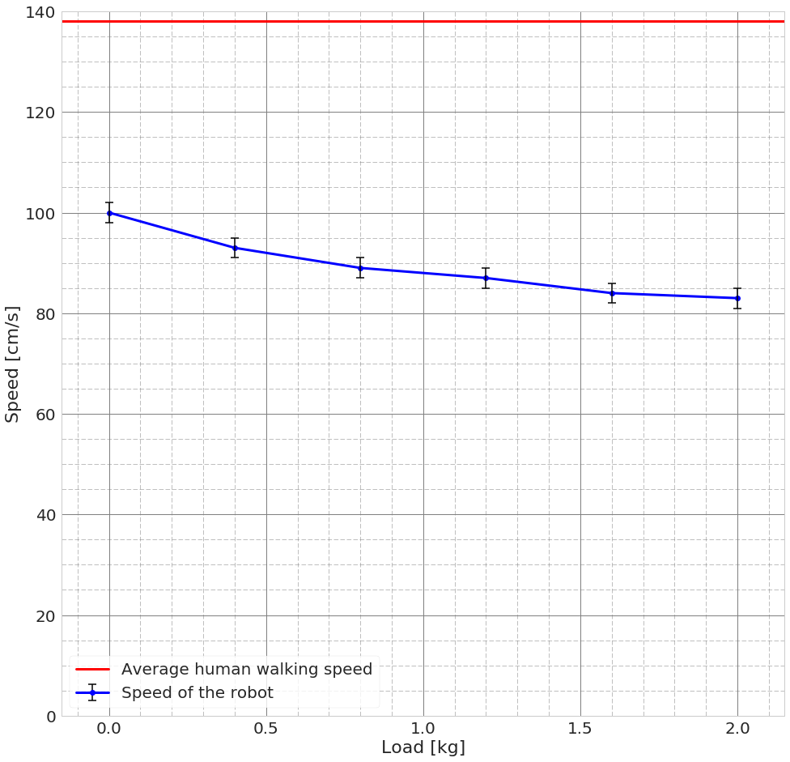

```python
%matplotlib inline

import numpy as np
import matplotlib.pyplot as plt
import pandas as pd
import seaborn as sns

# Set common default style for plots
sns.set(context='notebook', style='whitegrid', font_scale=2.0, rc={'figure.figsize': (16,16)})
```

### Preparing data


```python
load = np.array([0, 0.4, 0.8, 1.2, 1.6, 2.0])  # Tested loads in kg (real measurements)
speed = np.array([100, 93, 89, 87, 84, 83])    # Arnold's speed in cm/s (real measurements)
human_speed = 138  # cm/s
# load_error < 0.001
speed_error = 2  # educated guess
```

### Plot


```python
plt.errorbar(load, speed, yerr=speed_error, fmt='bo-', linewidth=3.0,
             ecolor='k', barsabove=True, elinewidth=1.5, capthick=1.5, capsize=5)
plt.plot([-0.2, 2.2], [human_speed, human_speed], 'r-', linewidth=3.0)

plt.xlim(-0.15, 2.15)
plt.ylim(0, 140)
plt.minorticks_on()
plt.grid(b=True, which='minor', color='grey', linestyle='--', linewidth=0.5)
plt.grid(b=True, which='major', color='grey', linestyle='-', linewidth=1.0)
plt.xlabel('Load [kg]')
plt.ylabel('Speed [cm/s]')
plt.legend(('Average human walking speed', 'Speed of the robot'), frameon=True, fancybox=True)

plt.show()
```

    /home/brano/miniconda2/envs/sdp/lib/python3.4/site-packages/matplotlib/font_manager.py:1297: UserWarning: findfont: Font family ['sans-serif'] not found. Falling back to DejaVu Sans
      (prop.get_family(), self.defaultFamily[fontext]))




